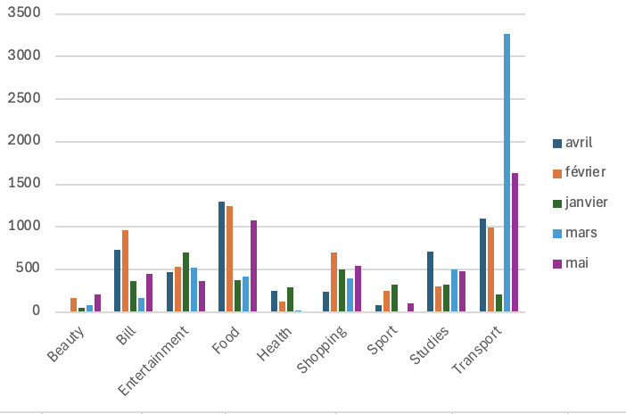
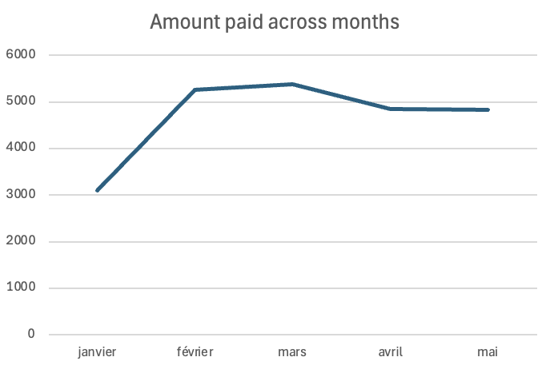
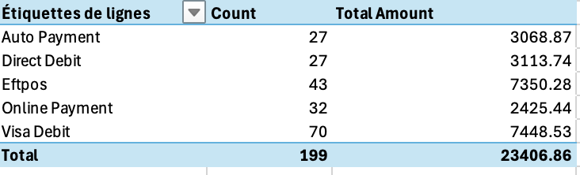
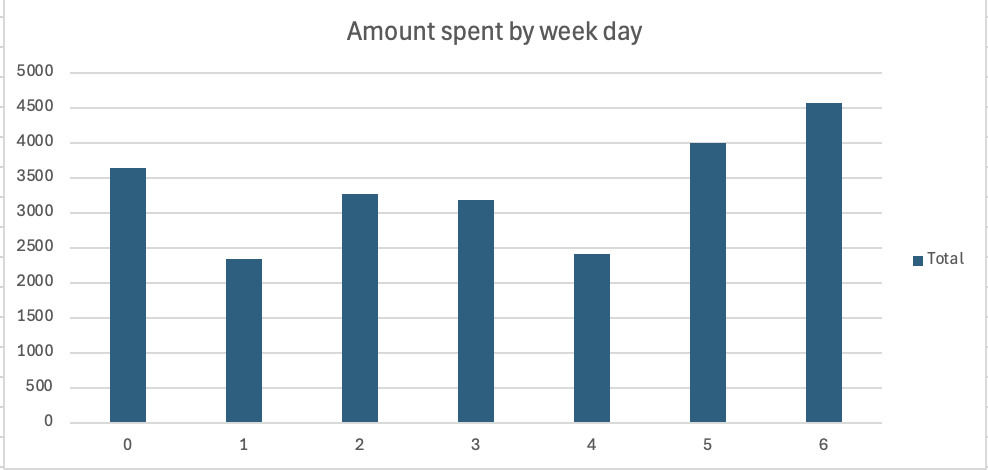

# Personal Finance Intelligence: End-to-End ETL & Expense Analytics on Real Auckland Banking Data

## Executive Summary

Transformed 5 months of raw ASB bank exports (Jan–May 2025) into a fully automated analytics pipeline using Power Query and Excel Pivot Tables. The source data presented significant real-world data quality challenges: inconsistent column naming across files, mixed date formats, inconsistent category labels, and junk rows embedded in exports. After building a repeatable ETL pipeline and a category mapping table, the cleaned dataset revealed **NZD $23,406 in total spending** across 199 transactions — with Transport as the dominant category at **31% of spend** and Food as the highest-frequency category.

---

## Business Problem

Personal finance data exported from retail banks is rarely clean or analysis-ready. ASB's Internet Banking export produces a different column schema depending on the export method, mixes date formats, embeds footer rows and blank lines, and uses inconsistent category labels across months. Without a structured transformation layer, any analysis needs to be redone manually every month — making trend tracking practically impossible.

The goal was to build a single automated pipeline that ingests any number of monthly export files from a folder, cleans and standardises them, and feeds a consistent set of Pivot Tables for ongoing personal finance monitoring — with zero manual rework when a new month is added.

---

## Methodology

Rather than using the native "Combine & Load" wizard — which enforces a rigid schema from the first file and breaks on schema drift — the pipeline uses a manual `Excel.Workbook()` approach to open each file independently before combining. This decouples ingestion from transformation and handles month-to-month column inconsistencies gracefully.

A custom **category mapping table** was built as a separate Power Query connection to standardise 40+ raw category variants into 9 clean categories via a Left Outer merge. This approach was chosen over repeated Replace Values steps because it is maintainable — new variants are handled by adding a row to the mapping table, not editing the query itself.

---

## Technical Skills

**Tools:** Microsoft Excel 365, Power Query (M language)

**Advanced techniques used:**
- Manual folder combine via `Excel.Workbook([Content], true)` to bypass schema-enforcement limitations of the native combine wizard
- Multi-expansion pattern (binary → sheet level → row level) for nested workbook content
- Conditional column logic for fallback merchant name resolution when the Merchant field is blank
- Left Outer merge join between the main fact table and a standalone category mapping reference table
- Column consolidation across schema variants using chained `if/else null` logic
- Date decomposition into Day, Month Name, Year, and Weekday columns for multi-dimensional Pivot slicing
- Amount sign normalisation (× -1) to flip ASB's native negative-debit convention for intuitive aggregation

---

## Results & Recommendations

**Total spend Jan–May 2025: NZD $23,407 across 199 transactions**

### Spend by Category

Transport dominates at 31% of total spend — though this is partly inflated by one-off travel bookings (flights, car hire, Airbnb) sitting in the same category as recurring petrol and public transport costs. Food is the most frequent category with multiple transactions per week across groceries, cafés, and delivery apps.

### Monthly Spending Trend

Spending peaks in February and March, driven largely by travel-related and study expenses. January is the lowest month at $3,094 — consistent with post-holiday reduced activity.

### Payment Method Breakdown

Visa Debit leads in transaction count (70 transactions) but Eftpos is close in total dollar value ($7,350 vs $7,449) with fewer transactions — suggesting larger purchases tend to go through Eftpos. Direct Debit and Auto Payment handle recurring bills reliably.

### Spend by Day of Week

Weekend spending (Friday–Sunday) is noticeably higher than weekday spend, concentrated in Food and Entertainment — reflecting lifestyle and social spending patterns.

**Key recommendations:**
- Separate one-off Travel (flights, Airbnb, car hire) from recurring Transport to get a cleaner picture of fixed vs discretionary spend
- Set a monthly cap on delivery app spend (UberEats, DoorDash, Menulog) — one of the most accessible levers for reducing daily Food costs
- Improve receipt capture rate — a significant share of transactions have no receipt recorded, which matters for any expense reimbursement context

---

## Next Steps & Limitations

**What I'd build next:**
- A **budget vs actual** layer — adding a monthly target table as a second reference query and surfacing variance in the Pivot
- A **Dashboard sheet** consolidating all charts with slicers for month and category filtering
- Extension to handle **credit card exports**, which typically have a different schema again

**Limitations:**
- The category mapping covers variants observed in this dataset — new export variants from future months may introduce unmapped labels until the table is updated
- Sub-category data is inconsistently populated and was not standardised in this version, limiting drill-down depth
- 5 months is insufficient to identify seasonal patterns confidently — 12+ months would be needed for robust trend analysis
